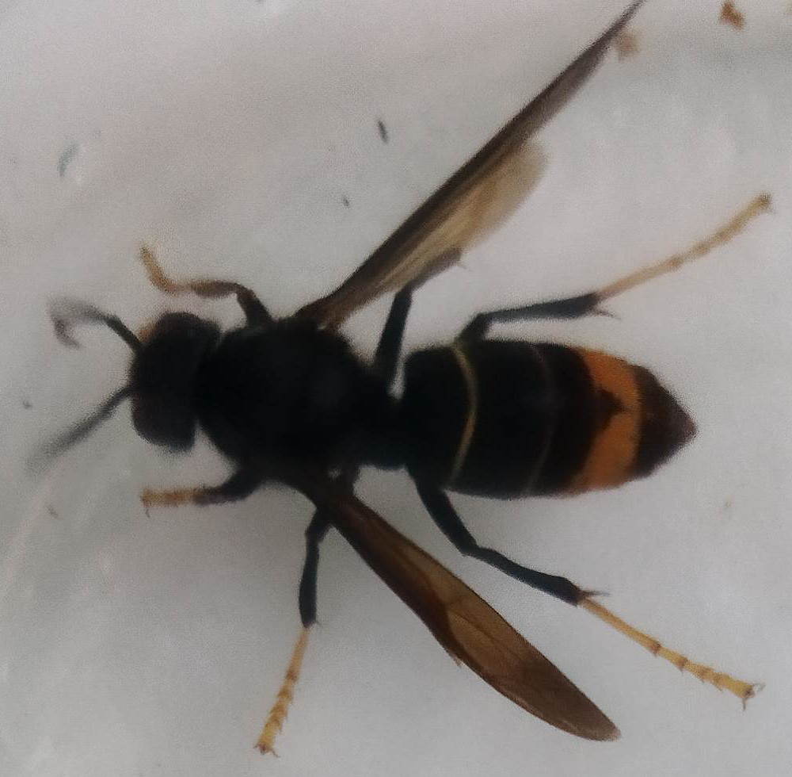
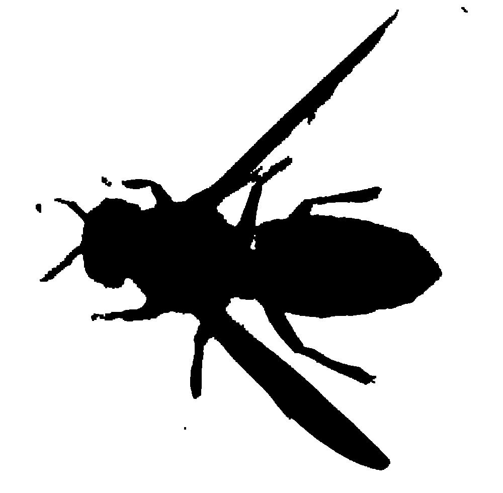
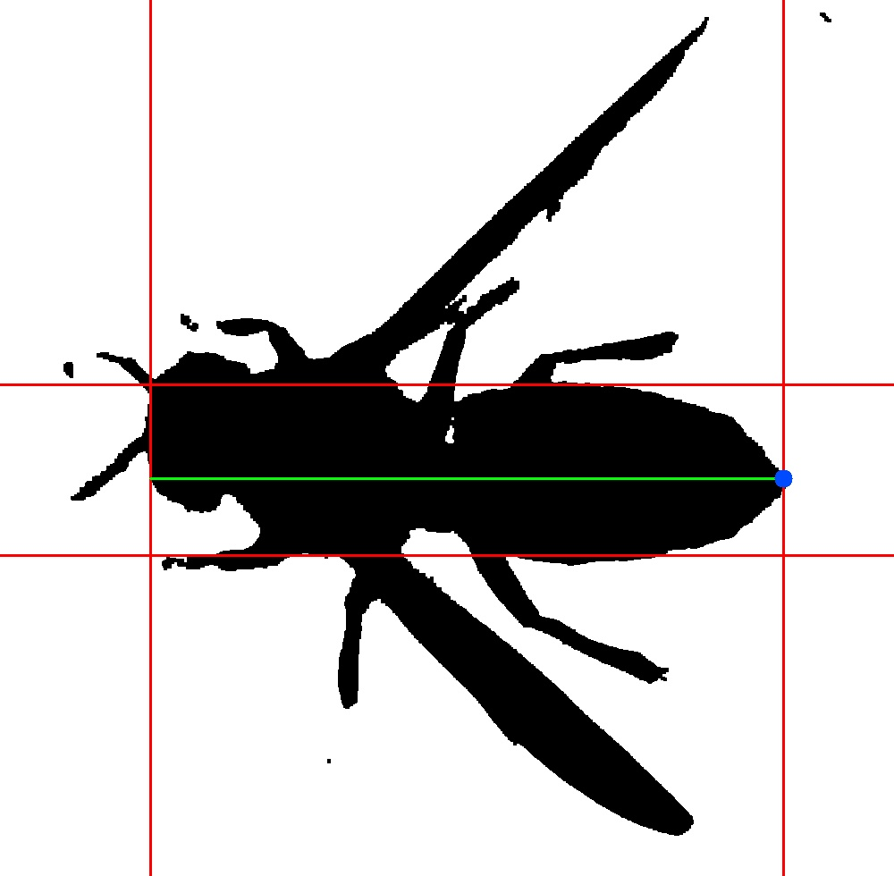

# Projet de Génie Logiciel : Analyse d'images de Frelons

Le but de ce projet est d'exécuter un traitement procédural sur des photos de frelons prises à partir d'un piège et de déterminer sa caste (Fondatrice, Ouvrière ou Mâle).

## Installation

Les packages requis pour l'exécution sont : </br>

- opencv-python
- minidom
- numpy

Ils sont installables via la commande


```bash
pip3 install '<Nom du Paquet>'
```

## Usage

Pour lancer le programme, on renseignera la commande suivante :

```bash
python3 main.py '<Chemin image>'
```

## Fonctionnement du programme

En partant de l'image exemple suivante :


### Détourage

Par un système de masques retenant couleurs sombres et le gradiant jaune-orange, on obtient un masque de détourage. Il est ensute traité par par dilatation-érosion pour éliminer le bruit et d'éventuels artefacts visuels indésirables :



## Recherche de la caste

On cherche donc grâce à l'image détourée la caste à laquelle appartient le frelon.

### Critère de longeur

Ici on détermine la longeur de l'insecte pour savoir si c'est une fondatrice ou non. Par comptage de pixels on peut déterminer la taille et l'extrémité de l'abdomen du frelon :



### Critère de forme de l'abdomen

On peu déterminer le sexe de l'insecte de par la forme de son abdomen. Si il est pointu, c'est une femelle, sinon, c'est un mâle.
Le sexe est déterminé par aggrégat de resultats de plusieur méthodes de recherches.

- Régréssion Linéaire et Logarithmique des points de contour de l'abdomen
- Angle de croisement des droites de régression linéaire des deux côtés de l'abdomen

## Restitution des résultats

Les résultats obtenus sont renseignés dans un fichier XML comme suit :

```xml
<?xml version="1.0" ?>
  <data>
    <picture name="15.jpg">
      <caracteristics>
        <cast>Fondatrice</cast>
        <hornetlength unit="mm">24</hornetlength>
        <abdomenshape>Pointu</abdomenshape>
        <wingsspacing unit="mm">UNDEFINED</wingsspacing>
      </caracteristics>
      <metadata>
        <date>2022:11:02</date>
        <time>14:21:45</time>
        <trapreference>00001</trapreference>
      </metadata>
    </picture>
  </data>
```
Les métadonées sont récupérées à partir de la lecture du fichier .log attaché à chaque image.

## Génération de la documentation

Pour regénérer la documentation, exécutez :

```bash
bash Documentation/build.sh
```

Les fichiers (dont index.html) se situeront dans Documentation/_build/html

## License

Créé par Lucas SENLECQUE et Timothée AUFFRET, dans le cadre d'un projet d'études à Polytech Tours.
2022-2023